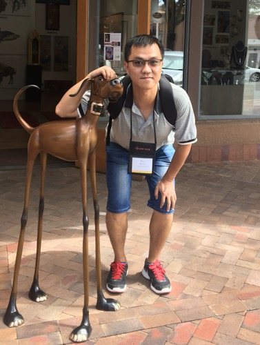

## Wen Zhang (张文) 

Working in Smart Platform Product Department of Tencent Inc., Beijing, China. **[Intern recruiting ...]**

Interested in NMT, NLP and ML.

**[ACL 2019 Best Long Paper Award]:** [Bridging the Gap between Training and Inference for Neural Machine Translation](https://www.aclweb.org/anthology/P19-1426)

## Personal Information

## Publications
**Wen Zhang**, Yang Feng, Fandong Meng, Di You and Qun Liu. 2019. [Bridging the Gap between Training and Inference for Neural Machine Translation](https://www.aclweb.org/anthology/P19-1426). In _Proceedings of the 57th Annual Meeting of the Association for Computational Linguistics (Volume 1: Long Papers)_ **(ACL 2019)**, pages 4334-4343, Florence, Italy, July 28th-August 2nd, 2019. Association for Computational Linguistics. [code](https://github.com/ictnlp/OR-NMT) **[CCF A类会议]** **[ACL 2019 Best Long Paper Award]**

**Wen Zhang**, Yang Feng and Qun Liu. 2021. Bridging the Gap between Training and Inference for Neural Machine Translation$^{*}$. In _Proceedings of the Twenty-Ninth International Joint Conference on Artificial Intelligence_ **(IJCAI-20)** Sister Conferences Best Papers Track, Kyoto, Japan. January 5-10, 2021. [code](https://github.com/ictnlp/OR-NMT) **[CCF A类会议]**

Yang Feng, Wanying Xie, Shuhao Gu, Chenze Shao, **Wen Zhang**, Zhengxin Yang, Dong Yu. 2020. Modeling Fluency and Faithfulness for Diverse Neural Machine Translation. In _Proceedings of the Thirty-Fourth AAAI Conference on Artificial Intelligence_ **(AAAI-20)**, New York, USA. February 7-12, 2020. [code](https://github.com/ictnlp/DiverseNMT) **[CCF A类会议]**

Haiyang Xue, Yang Feng, Di You, **Wen Zhang** and Jingyu Li. 2019. Neural Machine Translation with Bilingual History Involved Attention. In _Proceedings of the 8th CCF International Conference on Natural Language Processing and Chinese Computing_ **(NLPCC 2019)**, Dunhuang, China. October 9-14, 2019. **[CCF B类会议]**

**Wen Zhang**, Liang Huang, Yang Feng, Lei Shen, and Qun Liu. 2018b. [Speeding Up Neural Machine Translation Decoding by Cube Pruning](https://aclweb.org/anthology/D18-1460). In _Proceedings of the 2018 Conference on Empirical Methods in Natural Language Processing_ **(EMNLP 2018)**, pages 4284-4294, Brussels, Belgium, October 31-November 4, 2018. Association for Computational Linguistics. [code](https://github.com/ictnlp/CPDecoder/blob/master/searchs/cp.py) **[CCF B类会议]**

**Wen Zhang**, Jiawei Hu, Yang Feng, and Qun Liu. 2018a. [Refining Source Representations with Relation Networks for Neural Machine Translatio](http://aclweb.org/anthology/C18-1110). In _Proceedings of the 27th International Conference on Computational Linguistics_ **(COLING 2018)**, pages 1292-1303, SantaFe, New Mexico, USA, August 20-26, 2018. Association for Computational Linguistics. [code](https://github.com/ictnlp/RN4NMT) **[CCF B类会议]**

**张文**，冯洋，刘群，[基于简单循环单元的深层神经网络机器翻译模型](http://jcip.cipsc.org.cn/CN/article/downloadArticleFile.do?attachType=PDF&id=2646)[J]，中文信息学报，第32卷，第10期，36-44页，2018年10月。 **[国内核心期刊]**

Wenbin Jiang, **Wen Zhang**, Jinan Xu, and Rangjia Cai. 2016. [Automatic Cross-Lingual Similarization of Dependency Grammars for Tree-based Machine Translation](https://www.aclweb.org/anthology/D16-1048). In _Proceedings of the 2016 Conference on Empirical Methods in Natural Language Processing_ **(EMNLP 2016)**, pages 501-510, Austin, Texas, November 1–5, 2016. Association for Computational Linguistics. **[CCF B类会议]**

**Wen Zhang**, Qiuye Zhao, Wenbin Jiang and Qun Liu, [Bilingually Induced Clause Parser for Tree-based Translation](http://www.ai-ia.ac.cn/cwmt2015/file/CWMT2015\%E4\%BC\%9A\%E8\%AE\%AE\%E8\%AE\%BA\%E6\%96\%87-05.pdf). In _Proceedings of the 11th China Workshop on Machine Translation_ **(CWMT 2015)**, pages 30-35, Hefei, AnHui, China, September 23-25, 2015. **[国内会议]**

Yong Shan, Yang Feng, Jinchao Zhang, Fandong Meng, **Wen Zhang**. Improving Bidirectional Decoding with Dynamic Target Semantics in Neural Machine Translation. **[Arxiv]**
